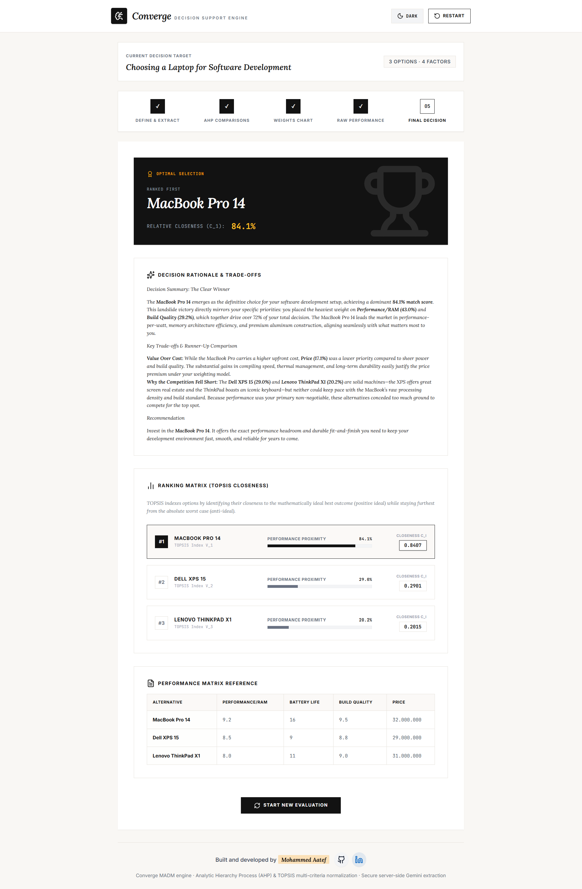
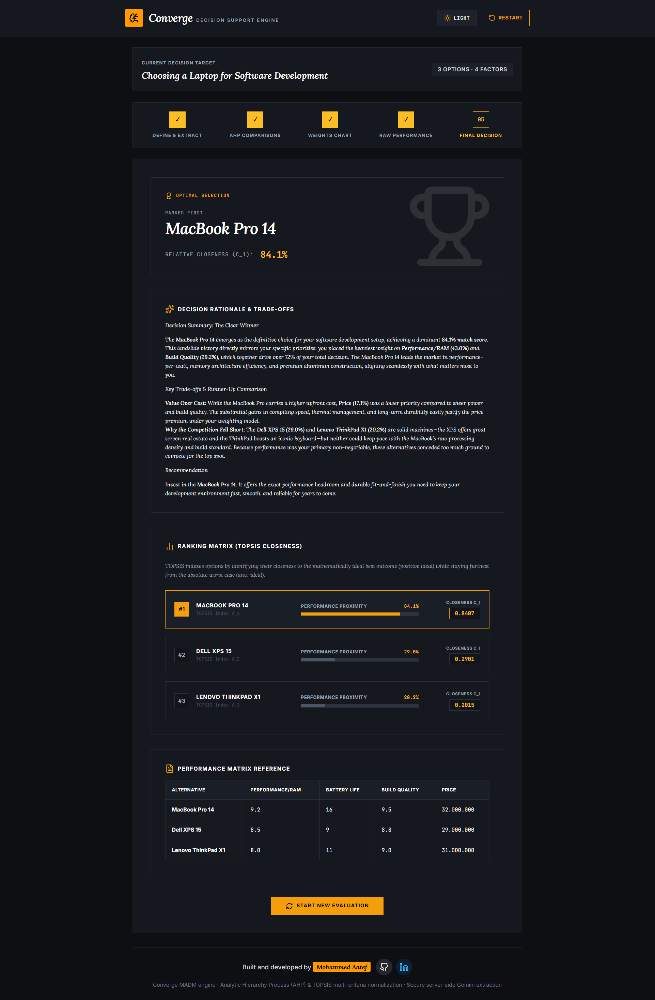

<div align="center">

# Converge

### AI-Assisted Decision Support Engine · AHP + TOPSIS

Turn a messy real-world decision into a clear, mathematically-ranked answer — in plain English.


<br>

### [**🚀 Try the Live Demo →**](https://your-vercel-url-here.vercel.app)

</div>

<br>

<div align="center">

| Light Mode | Dark Mode |
|---|---|
|  |  |

</div>

<br>

## What is Converge?

Converge takes a decision described in **plain English** — "I'm choosing between three job offers based on salary, growth, and location" — and turns it into a fully ranked, mathematically-grounded recommendation.

It combines two established Multi-Criteria Decision Analysis (MCDA) methods:

| Method | Role |
|---|---|
| **AHP** (Analytic Hierarchy Process) | Turns your relative preferences (via pairwise comparisons) into precise priority **weights** for each criterion, with a built-in consistency check |
| **TOPSIS** (Technique for Order Preference by Similarity to Ideal Solution) | Ranks your alternatives by how close they are to the mathematically ideal option, using those weights |

An LLM (Gemini) handles the natural-language understanding — extracting your alternatives and criteria automatically — while the actual ranking math is deterministic, transparent, and fully auditable.

<br>

## ✨ Features

- 🧠 **Natural language input** — describe your decision like you would to a friend
- ⚖️ **Interactive AHP pairwise comparisons** with live consistency-ratio (CR) feedback
- 🔧 **Smart auto-adjustment** if your comparisons are inconsistent (log-ratio interpolation, not naive averaging)
- 📊 **TOPSIS ranking** with full transparency into weights, ideal solutions, and closeness scores
- 🌓 **Dark / light mode** with smooth, uniform transitions
- 💾 **Session persistence** — refresh mid-decision without losing your progress
- 📱 **Mobile-first responsive design**
- 🛡️ **Defensive math** — handles malformed input, mismatched data, and tied rankings gracefully instead of silently producing wrong answers

<br>

## 🧭 How It Works

```
1. Define & Extract     →  Describe your decision in plain English (AI-assisted)
2. AHP Comparisons      →  Weigh criteria against each other, pairwise
3. Weights Chart        →  Review computed priority weights + consistency ratio
4. Raw Performance      →  Enter how each alternative scores on each criterion
5. Final Decision       →  Get your ranked result, powered by TOPSIS
```

<br>

## 🛠️ Tech Stack

| Layer | Technology |
|---|---|
| Frontend | React 19, TypeScript, Tailwind CSS v4, Lucide Icons |
| Backend | Node.js, Express (local dev) / Vercel Serverless Functions (production) |
| AI | Google Gemini API (`@google/genai`) |
| Math Engine | Custom TypeScript implementation of AHP + TOPSIS |
| Hosting | Vercel |

<br>

## 🚀 Getting Started

### Prerequisites
- Node.js 18+
- A [Google AI Studio](https://aistudio.google.com/app/apikey) API key

### Setup

```bash
# Clone the repo
git clone https://github.com/TR-Mohd/converge-madm.git
cd converge-madm

# Install dependencies
npm install

# Add your API key
echo 'GEMINI_API_KEY=your_key_here' > .env

# Run locally
npm run dev
```

The app runs at `http://localhost:3000`.

### Deploying

This project is pre-configured for **zero-config Vercel deployment**. Push to your connected branch, and set `GEMINI_API_KEY` under **Vercel → Settings → Environment Variables** (make sure it's enabled for the **Production** scope).

<br>

## 📁 Project Structure

```
converge-madm/
├── api/                    # Vercel serverless functions
│   ├── _gemini.ts          # Shared Gemini client + fallback logic
│   ├── extract.ts          # Natural language → structured decision
│   ├── auto-fill.ts        # AI-assisted data grid filling
│   └── summarize.ts        # Result rationale generation
├── server.ts               # Local dev server (Express)
├── src/
│   ├── App.tsx              # Wizard state machine
│   ├── utils/math.ts        # AHP + TOPSIS engine
│   ├── hooks/                # Session persistence, etc.
│   └── components/           # Step 1–5 wizard screens
└── KNOWN_ISSUES.md          # Incident log & troubleshooting history
```

<br>

## 🗺️ Roadmap

- [ ] Sub-criteria support (multi-level AHP hierarchy)
- [ ] Sensitivity analysis (drag a weight, watch rankings shift live)
- [ ] Full decision history (save/load named past decisions via database)
- [ ] PDF / CSV export of results

<br>

## 📄 License

MIT — see [`LICENSE`](./LICENSE) for details.

<br>

<div align="center">

*Built with AHP, TOPSIS, and a healthy amount of debugging.*

</div>
